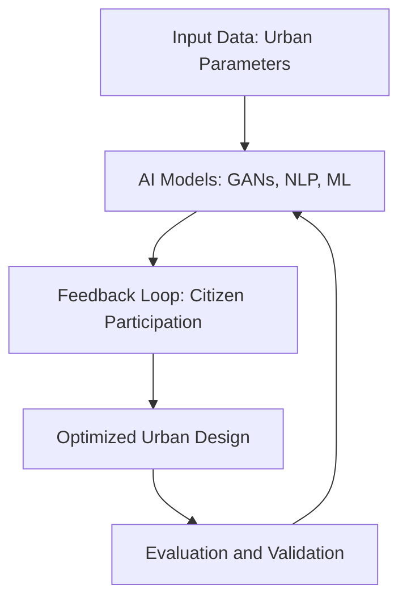

# Literature Review: Role of AI in Urban Planning and Participation

## Abstract
This review explores the phenomenon of artificial intelligence (AI) in urban planning and governance. It discusses the integration of AI technologies, such as machine learning, generative adversarial networks (GANs), and natural language processing (NLP), in participatory urban design. The paper outlines the benefits of AI in design decision-making, project validation, and evaluation while addressing challenges like transparency, legal accountability, and potential biases in data.

---

## Background and Motivation

### Context
Urban planning has evolved significantly over the past century, transitioning from manual, intuition-driven processes to data-centric, technology-enabled methodologies. The growing complexity of urban systems, driven by rapid population growth, urban sprawl, and technological advancements, necessitates innovative approaches to manage cities effectively. AI has emerged as a transformative tool, capable of handling large-scale datasets generated by interconnected systems such as transportation networks, energy grids, and housing infrastructure. 

The integration of IoT devices, coupled with advancements in data collection and processing technologies, has created a unique opportunity for urban planners to utilize AI to optimize city operations. Urban areas are now massive hubs of data production, generating information on traffic patterns, resource consumption, social behavior, and environmental changes. AI leverages this data to provide actionable insights, predict future trends, and simulate urban growth scenarios. For example, smart transportation systems can use AI to adjust traffic signals in real time, reducing congestion and improving mobility. Similarly, AI can analyze energy usage patterns to optimize distribution and reduce waste.

### Problem Addressed
Traditional urban planning methods face significant limitations in addressing the demands of modern cities. Historically, planning relied heavily on static models, heuristic approaches, and human judgment, which often resulted in inefficiencies and suboptimal outcomes. These methods struggle to incorporate the dynamic and interconnected nature of contemporary urban systems. Moreover, traditional approaches rarely account for real-time data, citizen feedback, or predictive analytics, leaving them ill-equipped to respond to rapidly changing urban environments.

Another critical issue lies in the exclusion of participatory processes in traditional planning frameworks. Citizen involvement, though essential, is often limited to post-design feedback or isolated public consultations. This disconnect between planners and the community leads to developments that may not align with the needs or preferences of the residents. The lack of scalable, participatory mechanisms exacerbates inequalities and undermines trust in urban governance.

Existing literature highlights several gaps in understanding how AI can address these challenges. While AI has been applied extensively in other domains like healthcare and finance, its role in urban planning remains underexplored. Key gaps include:
- **Scalability:** Can AI-driven solutions be scaled to accommodate cities of varying sizes and complexities?
- **Ethical Considerations:** How can planners ensure AI systems are transparent, unbiased, and inclusive?
- **Integration Challenges:** What strategies are required to integrate AI tools with existing urban governance systems?

This study aims to fill these gaps by exploring how AI technologies can:
1. Enable data-driven decision-making by processing and analyzing large-scale urban datasets.
2. Enhance participatory planning through tools like NLP, which analyze citizen feedback to identify community priorities.
3. Provide predictive insights to proactively address issues like traffic congestion, energy inefficiency, and environmental degradation.
4. Simulate urban growth scenarios to support long-term planning and sustainability efforts.

### Significance
The research question—how AI can enhance urban planning processes—is of paramount importance as cities face unprecedented challenges in the 21st century. By 2050, nearly 68% of the global population is expected to reside in urban areas, placing immense pressure on infrastructure, housing, and transportation systems. Without significant advancements in planning methodologies, cities risk becoming unmanageable, exacerbating environmental, social, and economic issues.

AI offers a unique opportunity to revolutionize urban planning by addressing these challenges at multiple levels:

1. **Environmental Sustainability:** AI-driven optimization models can minimize resource consumption, reduce carbon emissions, and enhance urban resilience to climate change. For instance, AI can analyze environmental data to identify areas suitable for green spaces, thereby improving air quality and overall urban livability.

2. **Social Equity:** By integrating participatory feedback mechanisms, AI ensures that urban planning processes are inclusive and representative of diverse stakeholder needs. This democratization of decision-making helps bridge inequalities and fosters trust between citizens and planners.

3. **Economic Efficiency:** AI-powered simulations enable planners to evaluate multiple design scenarios, optimizing for cost-effectiveness while maintaining functionality. For example, AI can identify the most efficient routes for public transportation systems, reducing operational costs and improving accessibility.

4. **Real-Time Adaptability:** The dynamic nature of AI allows it to process real-time data and adapt to changing urban conditions. Smart systems powered by AI can respond to unexpected events, such as natural disasters or sudden population surges, ensuring cities remain resilient and functional.

The significance of this research extends beyond theoretical exploration. It provides a practical framework for urban planners, policymakers, and technologists to collaborate on creating smarter, more sustainable cities. By situating AI at the core of urban governance, this research highlights its potential to transform cities into adaptive ecosystems capable of addressing the complex challenges of the future.

---

## Methods Used
### Mathematical and Statistical Foundations
#### Machine Learning (ML)
- **Supervised Learning**: Applied for predictive tasks such as traffic flow forecasting and energy demand estimation. Algorithms like linear regression, decision trees, and support vector machines (SVMs) are commonly employed.
- **Unsupervised Learning**: Utilized for clustering urban zones based on parameters like population density, pollution levels, and infrastructure quality. Techniques include k-means clustering and hierarchical clustering.
- **Reinforcement Learning**: Focused on optimizing urban systems (e.g., adaptive traffic signal control). The Markov Decision Process (MDP) serves as the foundational framework, defining states, actions, rewards, and transitions.

#### Generative Adversarial Networks (GANs)
GANs consist of two neural networks:
- **Generator**: Produces synthetic urban designs by mapping latent variables to realistic outputs.
- **Discriminator**: Evaluates generated outputs against real datasets, providing feedback to improve design quality.
This iterative process minimizes the difference between generated and real urban layouts, enhancing simulation accuracy.

#### Natural Language Processing (NLP)
NLP methods analyze textual data from citizen feedback, policy documents, and urban surveys. Key techniques include:
- **Tokenization and Parsing**: Breaking text into analyzable units.
- **Sentiment Analysis**: Assessing public opinion on urban projects.
- **Topic Modeling**: Identifying recurring themes in participatory discussions using Latent Dirichlet Allocation (LDA).

#### Statistical Methods
- **Regression Analysis**: Used to identify relationships between urban parameters (e.g., population density and resource consumption).
- **Bayesian Inference**: Provides probabilistic insights into uncertain urban scenarios, such as disaster response planning.
- **Monte Carlo Simulations**: Simulate various urban growth scenarios, accounting for random variability.

### Innovative Approaches
1. **Feedback Loops**:
   - Real-time adjustments in urban planning based on sensor data (e.g., IoT-enabled traffic management).
2. **Hybrid Models**:
   - Combining parametric design with AI to iteratively optimize urban layouts.

---

## Key Findings and Significance
### Contributions
- **Enhanced Planning Efficiency**: AI accelerates data analysis and visualization, reducing the time required for urban planning.
- **Participatory Decision-Making**: Tools like GANs and NLP facilitate citizen engagement, enabling collaborative urban design.
- **Predictive Insights**: ML models forecast urban trends, aiding proactive decision-making.

### Implications
- **Scalability**: AI models can be adapted to diverse urban contexts, from small towns to megacities.
- **Sustainability**: AI-driven optimization reduces energy consumption and enhances resource utilization.
- **Equity**: Participatory AI ensures diverse stakeholder inclusion, addressing social inequalities in urban planning.

---

## Connections to Other Work
### Related Studies
- **Historical Foundations**:
  - Evolution of computer-aided design (CAD) tools in architecture.
  - Emergence of parametric design and its integration with AI.
- **Emerging Trends**:
  - AI-powered GIS tools for spatial analysis.
  - Integration of IoT with urban planning systems.

### Advancements
- **Building on Past Research**: Leveraging machine learning advancements to address contemporary urban challenges.
- **Unique Contributions**: Incorporating citizen feedback into AI-driven models for participatory planning.

### Seminal Works Referenced
- Studies on urban mobility optimization using reinforcement learning.
- Research on smart cities, IoT, and urban data analytics.

---

## Relevance to Capstone Project
### Methods for Application
1. **Incorporating GANs**:
   - Generate and validate urban design prototypes.
   - Optimize layouts for transportation, green spaces, and utilities.
2. **Leveraging NLP**:
   - Analyze citizen feedback to prioritize urban projects.
   - Summarize public sentiment to guide policy decisions.

### Expanding Scope
- Addressing gaps in subjective data analysis (e.g., quality of life metrics).
- Exploring adaptive strategies for disaster management and climate resilience.

---

## Additional Diagram
Below is a diagram illustrating the iterative AI-driven urban planning process:

---

## References
1. Adam Urban, David Hick, Joerg Rainer Noennig, Dietrich Kammer. "With a Little Help From AI: Pros and Cons of AI in Urban Planning and Participation." *International Journal of Urban Planning and Smart Cities*, Vol. 2, Issue 2, 2021.
2. DOI: [10.4018/IJUPSC.2021070102](https://doi.org/10.4018/IJUPSC.2021070102)

---

## Notes
- Ensure alignment with APA/IEEE standards for citations.
- This document serves as an in-depth overview for integration into a GitHub repository.
