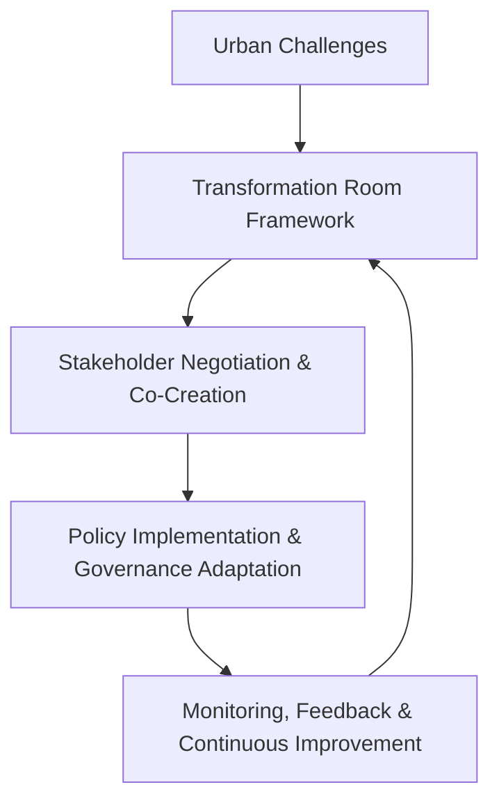

# Transformation Rooms: Building Transformative Capacity for European Cities

## Abstract
This literature review explores the concept of *Transformation Rooms* as a framework for enhancing urban transformative capacity in European cities. The study discusses the role of multi-level governance, socio-technical systems, and transformative leadership in enabling sustainable urban development. The *Transformation Room* model serves as a negotiation and orchestration format that facilitates co-creation, experimentation, and policy implementation, fostering collaboration between niche innovations and established urban regimes.

---

## Background and Motivation
### Context
Cities across Europe face significant societal and environmental challenges, necessitating a shift toward sustainable urban governance models. Traditional top-down urban planning methods struggle to accommodate the complexities of modern cities, where economic, social, and environmental factors are deeply interwoven. The *Transformation Room* concept offers a participatory governance approach, integrating various stakeholders—including policymakers, citizens, and researchers—into the decision-making process.

### Problem Addressed
Conventional urban governance models often lack the flexibility to adapt to rapid changes in technology, citizen engagement, and environmental constraints. Key issues include:
- Fragmentation between local, national, and transnational governance levels.
- Limited mechanisms for citizen participation and grassroots innovation.
- The challenge of aligning urban transformation initiatives with broader policy frameworks.

The *Transformation Room* seeks to bridge these gaps by establishing structured environments where stakeholders can collaboratively define roles, negotiate solutions, and implement transformative policies.

### Significance
The significance of this research lies in its potential to reshape urban governance frameworks. By incorporating co-creation and multi-level governance principles, the *Transformation Room* fosters:
- **Enhanced participatory decision-making**: Encouraging direct citizen involvement in urban planning.
- **Innovative urban solutions**: Facilitating experimentation and cross-sector collaboration.
- **Scalability and adaptability**: Enabling cities to respond dynamically to socio-economic and environmental shifts.

---

## Methods Used
### Theoretical Foundations
The study employs a socio-technical systems approach, integrating:
- **Multi-Level Perspective (MLP)**: Examining interactions between niche innovations, established urban regimes, and broader socio-political landscapes.
- **Systemic Change Frameworks**: Evaluating structural and procedural elements necessary for transformative leadership.
- **Participatory Governance Models**: Assessing the impact of citizen engagement and co-creation processes.

### Implementation Strategies
- **Structural Elements**:
  - Defining roles and governance structures within urban ecosystems.
  - Creating platforms for transnational collaboration and alignment.
- **Process Elements**:
  - Establishing feedback loops for continuous adaptation.
  - Supporting experimentation through pilot projects and urban living labs.

---

## Key Findings and Significance
### Contributions
- **Transformative Leadership Framework**: Outlines leadership models that enhance urban resilience.
- **Co-Creation Mechanisms**: Identifies methodologies for integrating citizen feedback into policy design.
- **Governance Innovations**: Proposes hybrid governance structures that balance regulatory oversight with bottom-up initiatives.

### Implications
- **Policy Development**: Provides insights for integrating participatory governance into European urban policies.
- **Sustainability Planning**: Supports the alignment of urban development strategies with long-term ecological and economic goals.
- **Replication Potential**: Offers a scalable model applicable to cities across different socio-political contexts.

---

## Connections to Other Work
### Related Studies
- Historical perspectives on collaborative urban governance.
- Comparative analysis of smart city frameworks and participatory planning models.

### Advancements
- Enhances existing urban resilience models by integrating *Transformation Room* principles.
- Builds on socio-technical transition theories to create actionable governance strategies.

---

## Relevance to Urban Development Projects
### Methods for Application
- **Policy Integration**: Embedding *Transformation Room* concepts into urban master plans.
- **Stakeholder Engagement**: Leveraging digital platforms for real-time citizen participation.
- **Pilot Implementations**: Testing governance frameworks in select European cities before broader rollout.

### Expanding Scope
- Exploring intersections between *Transformation Rooms* and emerging digital governance technologies.
- Assessing long-term impacts on social equity, economic development, and environmental resilience.

---

## Additional Diagram
Below is a conceptual diagram illustrating the *Transformation Room* process:

---

## References
1. Gudrun Rita Haindlmaier, Petra Wagner, Doris Wilhelmer. *Transformation Rooms: Building Transformative Capacity for European Cities*. International Journal of Urban Planning and Smart Cities, Vol. 2, Issue 2, 2021.
2. DOI: [10.4018/IJUPSC.2021070104](https://doi.org/10.4018/IJUPSC.2021070104)

---

## Notes
- Ensure alignment with APA/IEEE citation formats if publishing.
- This document serves as a structured overview for integration into a GitHub repository.
