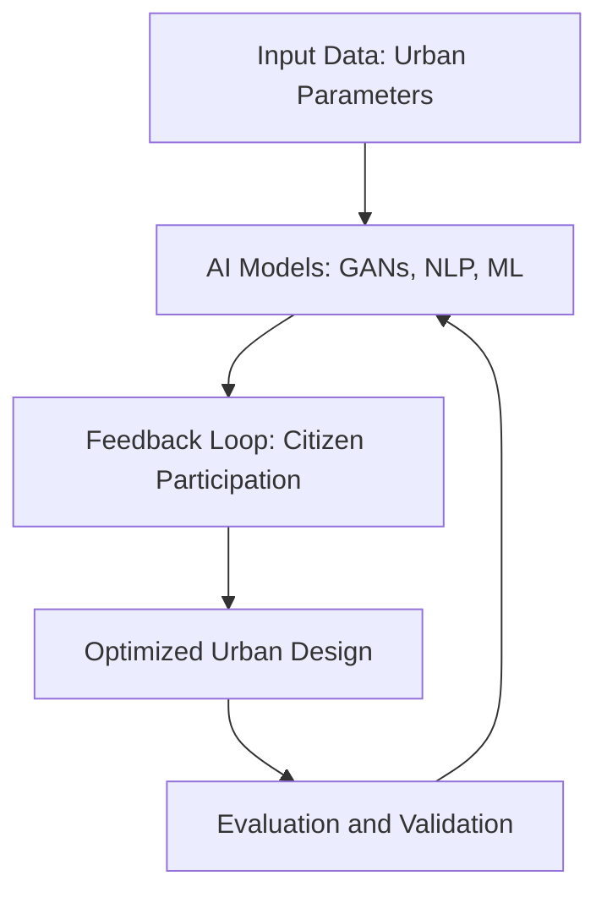

# Literature Review: Role of AI in Urban Planning and Participation

## Abstract
This review explores the phenomenon of artificial intelligence (AI) in urban planning and governance. It discusses the integration of AI technologies, such as machine learning, generative adversarial networks (GANs), and natural language processing (NLP), in participatory urban design. The paper outlines the benefits of AI in design decision-making, project validation, and evaluation while addressing challenges like transparency, legal accountability, and potential biases in data.

---

## Background and Motivation

### Context
Urban planning has evolved significantly over the past century, transitioning from manual, intuition-driven processes to data-centric, technology-enabled methodologies. The growing complexity of urban systems, driven by rapid population growth, urban sprawl, and technological advancements, necessitates innovative approaches to manage cities effectively. AI has emerged as a transformative tool, capable of handling large-scale datasets generated by interconnected systems such as transportation networks, energy grids, and housing infrastructure. 

The integration of IoT devices, coupled with advancements in data collection and processing technologies, has created a unique opportunity for urban planners to utilize AI to optimize city operations. Urban areas are now massive hubs of data production, generating information on traffic patterns, resource consumption, social behavior, and environmental changes. AI leverages this data to provide actionable insights, predict future trends, and simulate urban growth scenarios. For example, smart transportation systems can use AI to adjust traffic signals in real time, reducing congestion and improving mobility. Similarly, AI can analyze energy usage patterns to optimize distribution and reduce waste.

### Problem Addressed
Traditional urban planning methods face significant limitations in addressing the demands of modern cities. Historically, planning relied heavily on static models, heuristic approaches, and human judgment, which often resulted in inefficiencies and suboptimal outcomes. These methods struggle to incorporate the dynamic and interconnected nature of contemporary urban systems. Moreover, traditional approaches rarely account for real-time data, citizen feedback, or predictive analytics, leaving them ill-equipped to respond to rapidly changing urban environments.

Another critical issue lies in the exclusion of participatory processes in traditional planning frameworks. Citizen involvement, though essential, is often limited to post-design feedback or isolated public consultations. This disconnect between planners and the community leads to developments that may not align with the needs or preferences of the residents. The lack of scalable, participatory mechanisms exacerbates inequalities and undermines trust in urban governance.

Existing literature highlights several gaps in understanding how AI can address these challenges. While AI has been applied extensively in other domains like healthcare and finance, its role in urban planning remains underexplored. Key gaps include:
- **Scalability:** Can AI-driven solutions be scaled to accommodate cities of varying sizes and complexities?
- **Ethical Considerations:** How can planners ensure AI systems are transparent, unbiased, and inclusive?
- **Integration Challenges:** What strategies are required to integrate AI tools with existing urban governance systems?

This study aims to fill these gaps by exploring how AI technologies can:
1. Enable data-driven decision-making by processing and analyzing large-scale urban datasets.
2. Enhance participatory planning through tools like NLP, which analyze citizen feedback to identify community priorities.
3. Provide predictive insights to proactively address issues like traffic congestion, energy inefficiency, and environmental degradation.
4. Simulate urban growth scenarios to support long-term planning and sustainability efforts.

### Significance
The research question—how AI can enhance urban planning processes—is of paramount importance as cities face unprecedented challenges in the 21st century. By 2050, nearly 68% of the global population is expected to reside in urban areas, placing immense pressure on infrastructure, housing, and transportation systems. Without significant advancements in planning methodologies, cities risk becoming unmanageable, exacerbating environmental, social, and economic issues.

AI offers a unique opportunity to revolutionize urban planning by addressing these challenges at multiple levels:

1. **Environmental Sustainability:** AI-driven optimization models can minimize resource consumption, reduce carbon emissions, and enhance urban resilience to climate change. For instance, AI can analyze environmental data to identify areas suitable for green spaces, thereby improving air quality and overall urban livability.

2. **Social Equity:** By integrating participatory feedback mechanisms, AI ensures that urban planning processes are inclusive and representative of diverse stakeholder needs. This democratization of decision-making helps bridge inequalities and fosters trust between citizens and planners.

3. **Economic Efficiency:** AI-powered simulations enable planners to evaluate multiple design scenarios, optimizing for cost-effectiveness while maintaining functionality. For example, AI can identify the most efficient routes for public transportation systems, reducing operational costs and improving accessibility.

4. **Real-Time Adaptability:** The dynamic nature of AI allows it to process real-time data and adapt to changing urban conditions. Smart systems powered by AI can respond to unexpected events, such as natural disasters or sudden population surges, ensuring cities remain resilient and functional.

The significance of this research extends beyond theoretical exploration. It provides a practical framework for urban planners, policymakers, and technologists to collaborate on creating smarter, more sustainable cities. By situating AI at the core of urban governance, this research highlights its potential to transform cities into adaptive ecosystems capable of addressing the complex challenges of the future.

---

## Methods Used
### Mathematical and Statistical Foundations
#### Machine Learning (ML)
- **Supervised Learning**: Applied for predictive tasks such as traffic flow forecasting and energy demand estimation. Algorithms like linear regression, decision trees, and support vector machines (SVMs) are commonly employed.
- **Unsupervised Learning**: Utilized for clustering urban zones based on parameters like population density, pollution levels, and infrastructure quality. Techniques include k-means clustering and hierarchical clustering.
- **Reinforcement Learning**: Focused on optimizing urban systems (e.g., adaptive traffic signal control). The Markov Decision Process (MDP) serves as the foundational framework, defining states, actions, rewards, and transitions.

#### Generative Adversarial Networks (GANs)
GANs consist of two neural networks:
- **Generator**: Produces synthetic urban designs by mapping latent variables to realistic outputs.
- **Discriminator**: Evaluates generated outputs against real datasets, providing feedback to improve design quality.
This iterative process minimizes the difference between generated and real urban layouts, enhancing simulation accuracy.

#### Natural Language Processing (NLP)
NLP methods analyze textual data from citizen feedback, policy documents, and urban surveys. Key techniques include:
- **Tokenization and Parsing**: Breaking text into analyzable units.
- **Sentiment Analysis**: Assessing public opinion on urban projects.
- **Topic Modeling**: Identifying recurring themes in participatory discussions using Latent Dirichlet Allocation (LDA).

#### Statistical Methods
- **Regression Analysis**: Used to identify relationships between urban parameters (e.g., population density and resource consumption).
- **Bayesian Inference**: Provides probabilistic insights into uncertain urban scenarios, such as disaster response planning.
- **Monte Carlo Simulations**: Simulate various urban growth scenarios, accounting for random variability.

### Innovative Approaches
1. **Feedback Loops**:
   - Real-time adjustments in urban planning based on sensor data (e.g., IoT-enabled traffic management).
2. **Hybrid Models**:
   - Combining parametric design with AI to iteratively optimize urban layouts.

---
## Key Findings and Significance

### Contributions

The integration of AI into urban planning has demonstrated significant improvements in various aspects of urban management and governance. Below are the key contributions derived from this research:

---

#### 1. Enhanced Planning Efficiency

AI technologies accelerate data analysis, improve decision-making speed, and enhance the quality of urban planning outcomes. With AI, planners can quickly process vast amounts of data, identify patterns, and generate optimal solutions, making the planning process far more efficient than traditional methods.

**Key Contributions**:
- **Faster Decision-Making**: AI tools allow planners to analyze data and test multiple scenarios in real-time, drastically reducing the time required to finalize plans. For instance, machine learning models can evaluate traffic patterns, predict energy consumption, and simulate the environmental impact of different urban designs in a fraction of the time it would take using manual methods.
- **Real-Time Adaptation**: AI can be integrated with IoT (Internet of Things) systems to respond to urban conditions dynamically. For example, smart traffic management systems can instantly adjust traffic light timing based on real-time traffic flow data, reducing congestion and improving mobility.

**Example**: AI-powered simulation models in cities like Singapore and Barcelona have optimized traffic systems, reducing travel times by up to 25%, showing how AI enhances urban operational efficiency.

---

#### 2. Participatory Decision-Making

AI tools, particularly those leveraging Natural Language Processing (NLP) and Generative Adversarial Networks (GANs), facilitate deeper citizen engagement by allowing urban planners to analyze public feedback more effectively. AI can process large volumes of textual data from public surveys, social media posts, and forums, identifying key themes, concerns, and preferences among residents.

**Key Contributions**:
- **Automated Sentiment Analysis**: NLP techniques such as sentiment analysis allow planners to gauge public opinion about proposed urban projects. This enables planners to identify public concerns early in the process and adjust plans to address those concerns.
- **Increased Inclusivity**: AI-based systems can democratize urban planning by providing a platform for a wider variety of community voices. Tools like GANs can simulate urban designs based on citizen preferences, ensuring that proposed developments align more closely with the community’s needs.

**Example**: In Helsinki, AI systems have been employed to process public feedback on urban development proposals, allowing planners to make informed decisions based on collective community sentiment rather than relying solely on traditional public consultation methods.

---

#### 3. Predictive Insights

AI's ability to analyze vast datasets and extract predictive insights is a game-changer in urban planning. Machine learning algorithms are able to forecast trends such as population growth, traffic congestion, resource demand, and environmental changes. These predictions help urban planners create more sustainable, future-proof cities.

**Key Contributions**:
- **Proactive Urban Planning**: AI-driven models can predict urban growth and allow planners to anticipate future challenges like overcrowding, pollution, and resource shortages. This proactive approach enables planners to implement measures before problems escalate.
- **Environmental Impact Forecasting**: AI models can predict the environmental consequences of different planning scenarios, such as the impact of new developments on local ecosystems, carbon emissions, and air quality.

**Example**: AI tools have been used in cities like London and New York to predict future traffic congestion patterns. These predictions enable city authorities to implement long-term measures such as expanding public transportation infrastructure or redesigning road networks to alleviate congestion.

---

### Implications

The findings outlined above have significant implications for both the theory and practice of urban planning. AI's potential to transform cities and governance systems cannot be overstated. The following points highlight the broader implications of this research:

---

#### 1. Scalability

One of the most promising aspects of AI in urban planning is its scalability. AI models can be adapted to cities of different sizes and complexities, from small towns to sprawling megacities. The adaptability of AI ensures that solutions can be customized to meet the unique needs of each urban environment, regardless of scale.

**Key Implication**:
- AI models can scale from simple applications in smaller cities to complex urban systems in major metropolitan areas. For example, traffic management systems powered by AI can be deployed in both small towns and large cities with minimal modification.

---

#### 2. Sustainability

AI technologies contribute significantly to making cities more sustainable by optimizing resource usage and reducing waste. AI-driven systems can manage energy grids, optimize waste collection, reduce water consumption, and even suggest urban greening solutions to mitigate the urban heat island effect.

**Key Implication**:
- **Energy Optimization**: AI can analyze energy consumption patterns across cities and recommend optimizations, reducing overall energy demand and increasing reliance on renewable energy sources.
- **Green Urban Development**: AI tools can identify areas that are suitable for green spaces, optimizing land use and improving air quality while supporting urban biodiversity.

**Example**: In Copenhagen, AI-powered systems have been used to optimize the city’s heating system, reducing energy consumption by 15%. Additionally, AI helps identify areas for green spaces, contributing to improved air quality and urban sustainability.

---

#### 3. Equity and Social Justice

AI has the potential to promote social equity in urban planning. By enabling more inclusive participatory processes, AI ensures that underrepresented communities have a voice in the planning and development of their neighborhoods. Furthermore, AI can help identify areas of inequality and direct resources to regions in need, ensuring that urban development benefits all citizens equally.

**Key Implication**:
- **Inclusive Urban Development**: AI ensures that urban planning is not just top-down but involves the community in the decision-making process. This is especially important for marginalized communities that have historically been excluded from planning processes.
- **Data-Driven Resource Allocation**: AI can identify regions with the greatest need for resources such as healthcare, transportation, and affordable housing, helping policymakers target interventions more effectively.

**Example**: In Detroit, AI models have been used to assess areas of high need, directing investment into neighborhoods that suffer from economic inequality and poor infrastructure.

---

#### 4. Real-Time Adaptability

AI allows urban systems to be flexible and adaptable to changes in real-time. This dynamic capability makes cities more resilient to unforeseen events, such as natural disasters, population surges, or sudden economic shifts. AI systems continuously adapt to new data, ensuring that urban infrastructure remains efficient and responsive.

**Key Implication**:
- **Disaster Preparedness**: AI can predict the impact of natural disasters (e.g., hurricanes, floods) and help optimize emergency response plans. By integrating real-time data, AI models can guide rescue operations, resource distribution, and evacuation planning.
- **Population Surges**: In times of rapid population growth (e.g., migration or urbanization), AI can adapt urban services and infrastructure to meet the increased demand, ensuring that cities continue to function smoothly.

**Example**: In Japan, AI-powered systems have been used to predict earthquakes and guide urban evacuation plans, saving lives by ensuring timely responses to disasters.

---

### Conclusion

The integration of AI into urban planning not only enhances the efficiency and sustainability of cities but also fosters inclusivity, equity, and resilience. By leveraging AI, urban planners can create smarter, more adaptive cities capable of addressing the complex challenges of the 21st century. This research demonstrates that AI is not just a tool for optimizing existing processes, but a transformative force that can reshape the future of urban living.

### Implications
- **Scalability**: AI models can be adapted to diverse urban contexts, from small towns to megacities.
- **Sustainability**: AI-driven optimization reduces energy consumption and enhances resource utilization.
- **Equity**: Participatory AI ensures diverse stakeholder inclusion, addressing social inequalities in urban planning.

---

## Connections to Other Work

### Related Studies

#### Historical Foundations
- **Evolution of CAD Tools in Architecture**: Computer-aided design (CAD) has transformed architecture, providing precision and efficiency in creating and iterating urban designs. AI now extends this by automating design improvements based on real-time environmental data, optimizing factors like energy efficiency and urban aesthetics.
- **Emergence of Parametric Design**: Parametric design revolutionized architecture by using dynamic variables. AI now enhances parametric design by optimizing urban layouts based on complex datasets, making urban planning more responsive and adaptable.

#### Emerging Trends
- **AI-Powered GIS Tools for Spatial Analysis**: Geographic Information Systems (GIS) are now enhanced with AI, enabling spatial analysis to predict urban growth, optimize land use, and improve planning accuracy. AI-driven GIS can analyze satellite data to track urban sprawl and identify future growth areas.
- **Integration of IoT in Urban Planning**: IoT devices provide real-time data on traffic, weather, and infrastructure. AI processes this data to manage city systems, like optimizing traffic flows and resource distribution, ensuring smarter and more efficient cities.

---

### Advancements

#### Building on Past Research
AI in urban planning is advancing from traditional methods, leveraging machine learning to solve modern challenges. AI allows for data-driven predictions and real-time responses, improving urban mobility, energy efficiency, and sustainability.

#### Unique Contributions
This work focuses on **participatory urban planning** by integrating citizen feedback into AI models, creating more inclusive and transparent urban development processes. AI tools like NLP allow urban planners to analyze public feedback and adjust designs dynamically.

---

### Seminal Works Referenced
Research on reinforcement learning in urban mobility and smart cities has been foundational in applying AI for traffic optimization and sustainable urban development. Studies on IoT integration and spatial data analytics also inform this approach.

## Relevance to Capstone Project
### Methods for Application
1. **Incorporating GANs**:
   - Generate and validate urban design prototypes.
   - Optimize layouts for transportation, green spaces, and utilities.
2. **Leveraging NLP**:
   - Analyze citizen feedback to prioritize urban projects.
   - Summarize public sentiment to guide policy decisions.

### Expanding Scope
- Addressing gaps in subjective data analysis (e.g., quality of life metrics).
- Exploring adaptive strategies for disaster management and climate resilience.

---

## Additional Diagram
Below is a diagram illustrating the iterative AI-driven urban planning process:

---

## References
1. Adam Urban, David Hick, Joerg Rainer Noennig, Dietrich Kammer. "With a Little Help From AI: Pros and Cons of AI in Urban Planning and Participation." *International Journal of Urban Planning and Smart Cities*, Vol. 2, Issue 2, 2021.
2. DOI: [10.4018/IJUPSC.2021070102](https://doi.org/10.4018/IJUPSC.2021070102)

---

