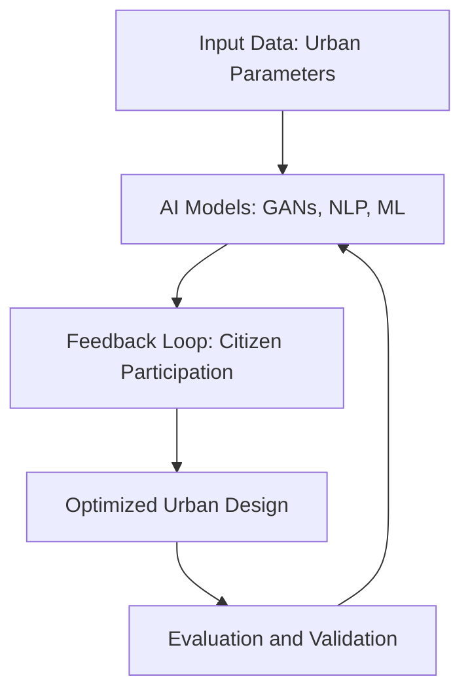

# Literature Review: Role of AI in Urban Planning and Participation

## Abstract
This review explores the phenomenon of artificial intelligence (AI) in urban planning and governance. It discusses the integration of AI technologies, such as machine learning, generative adversarial networks (GANs), and natural language processing (NLP), in participatory urban design. The paper outlines the benefits of AI in design decision-making, project validation, and evaluation while addressing challenges like transparency, legal accountability, and potential biases in data.

---

## Background and Motivation
### Context
Urban areas are growing in complexity, creating challenges in design, management, and optimization that exceed human cognitive capabilities. AI emerges as a powerful solution to address these issues by leveraging massive datasets generated by interconnected urban systems, including transportation, energy management, and infrastructure planning.

### Problem Addressed
Traditional urban planning methods rely heavily on manual decision-making, which is prone to inefficiencies and biases. The integration of AI enables automation, pattern recognition, and dynamic simulations, filling a critical gap in the urban planning domain. This technological leap allows planners to create smarter, more sustainable cities that are responsive to citizen needs.

### Significance
AI's capabilities are essential for addressing critical urban challenges such as traffic congestion, energy inefficiency, and environmental degradation. By incorporating AI, cities can achieve:
- Data-driven insights for informed decision-making.
- Improved stakeholder engagement through participatory frameworks.
- Enhanced accuracy in simulating urban growth and resource allocation.

---

## Methods Used
### Mathematical and Statistical Foundations
#### Machine Learning (ML)
- **Supervised Learning**: Applied for predictive tasks such as traffic flow forecasting and energy demand estimation. Algorithms like linear regression, decision trees, and support vector machines (SVMs) are commonly employed.
- **Unsupervised Learning**: Utilized for clustering urban zones based on parameters like population density, pollution levels, and infrastructure quality. Techniques include k-means clustering and hierarchical clustering.
- **Reinforcement Learning**: Focused on optimizing urban systems (e.g., adaptive traffic signal control). The Markov Decision Process (MDP) serves as the foundational framework, defining states, actions, rewards, and transitions.

#### Generative Adversarial Networks (GANs)
GANs consist of two neural networks:
- **Generator**: Produces synthetic urban designs by mapping latent variables to realistic outputs.
- **Discriminator**: Evaluates generated outputs against real datasets, providing feedback to improve design quality.
This iterative process minimizes the difference between generated and real urban layouts, enhancing simulation accuracy.

#### Natural Language Processing (NLP)
NLP methods analyze textual data from citizen feedback, policy documents, and urban surveys. Key techniques include:
- **Tokenization and Parsing**: Breaking text into analyzable units.
- **Sentiment Analysis**: Assessing public opinion on urban projects.
- **Topic Modeling**: Identifying recurring themes in participatory discussions using Latent Dirichlet Allocation (LDA).

#### Statistical Methods
- **Regression Analysis**: Used to identify relationships between urban parameters (e.g., population density and resource consumption).
- **Bayesian Inference**: Provides probabilistic insights into uncertain urban scenarios, such as disaster response planning.
- **Monte Carlo Simulations**: Simulate various urban growth scenarios, accounting for random variability.

### Innovative Approaches
1. **Feedback Loops**:
   - Real-time adjustments in urban planning based on sensor data (e.g., IoT-enabled traffic management).
2. **Hybrid Models**:
   - Combining parametric design with AI to iteratively optimize urban layouts.

---

## Key Findings and Significance
### Contributions
- **Enhanced Planning Efficiency**: AI accelerates data analysis and visualization, reducing the time required for urban planning.
- **Participatory Decision-Making**: Tools like GANs and NLP facilitate citizen engagement, enabling collaborative urban design.
- **Predictive Insights**: ML models forecast urban trends, aiding proactive decision-making.

### Implications
- **Scalability**: AI models can be adapted to diverse urban contexts, from small towns to megacities.
- **Sustainability**: AI-driven optimization reduces energy consumption and enhances resource utilization.
- **Equity**: Participatory AI ensures diverse stakeholder inclusion, addressing social inequalities in urban planning.

---

## Connections to Other Work
### Related Studies
- **Historical Foundations**:
  - Evolution of computer-aided design (CAD) tools in architecture.
  - Emergence of parametric design and its integration with AI.
- **Emerging Trends**:
  - AI-powered GIS tools for spatial analysis.
  - Integration of IoT with urban planning systems.

### Advancements
- **Building on Past Research**: Leveraging machine learning advancements to address contemporary urban challenges.
- **Unique Contributions**: Incorporating citizen feedback into AI-driven models for participatory planning.

### Seminal Works Referenced
- Studies on urban mobility optimization using reinforcement learning.
- Research on smart cities, IoT, and urban data analytics.

---

## Relevance to Capstone Project
### Methods for Application
1. **Incorporating GANs**:
   - Generate and validate urban design prototypes.
   - Optimize layouts for transportation, green spaces, and utilities.
2. **Leveraging NLP**:
   - Analyze citizen feedback to prioritize urban projects.
   - Summarize public sentiment to guide policy decisions.

### Expanding Scope
- Addressing gaps in subjective data analysis (e.g., quality of life metrics).
- Exploring adaptive strategies for disaster management and climate resilience.

---

## Additional Diagram
Below is a diagram illustrating the iterative AI-driven urban planning process:

---

## References
1. Adam Urban, David Hick, Joerg Rainer Noennig, Dietrich Kammer. "With a Little Help From AI: Pros and Cons of AI in Urban Planning and Participation." *International Journal of Urban Planning and Smart Cities*, Vol. 2, Issue 2, 2021.
2. DOI: [10.4018/IJUPSC.2021070102](https://doi.org/10.4018/IJUPSC.2021070102)

---

## Notes
- Ensure alignment with APA/IEEE standards for citations.
- This document serves as an in-depth overview for integration into a GitHub repository.
